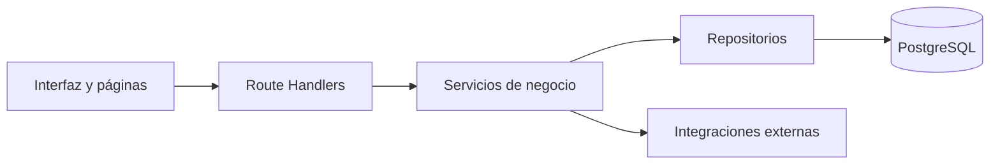

# Óptica Stylo

Plataforma web full-stack para centralizar los procesos comerciales, clínicos y de comercio electrónico de una óptica. Reúne la atención de pacientes, la operación interna, el punto de venta y la tienda pública en una sola aplicación.

## Alcance funcional

- Tienda pública con catálogo, carrito invitado o autenticado, pedidos y retiro en tienda.
- Reserva pública de horas y gestión interna de agenda profesional.
- Administración de pacientes, clientes, usuarios y profesionales.
- Ficha clínica, atenciones, recetas ópticas y conservación del historial.
- Punto de venta con cotizaciones, descuentos autorizados, abonos y comprobantes.
- Catálogo administrativo, imágenes en Cloudinary e inventario simulado.
- Pago mediante Mercado Pago y conciliación segura por webhook.
- Lectura asistida de recetas externas con revisión humana obligatoria.
- Probador virtual 3D con seguimiento facial y alternativa mediante fotografía.

## Tecnologías y herramientas utilizadas

| Área | Tecnología o herramienta | Uso en el proyecto |
| --- | --- | --- |
| Aplicación web | Next.js 16 con App Router | Páginas, interfaces internas, renderizado y API HTTP |
| Lenguaje y ejecución | JavaScript con módulos ES y Node.js | Lógica del cliente, servidor y scripts operativos |
| Interfaz | React, CSS Modules y Motion | Componentes, estilos y transiciones de la experiencia de usuario |
| Base de datos | PostgreSQL y `pg` | Persistencia de usuarios, pacientes, agenda, ventas y catálogo |
| Fechas | `date-fns` y `date-fns-tz` | Manejo de agenda y zona horaria `America/Santiago` |
| Recursos multimedia | Cloudinary | Almacenamiento de imágenes públicas y recetas privadas |
| Pagos | Mercado Pago | Checkout, webhooks y conciliación de pagos |
| Inteligencia artificial | API de OpenAI | Lectura asistida de recetas; el resultado siempre requiere revisión humana |
| Correo | Resend y Svix | Envío transaccional y verificación de webhooks |
| Experiencia 3D | Three.js, React Three Fiber, Drei y MediaPipe | Visualización de marcos y seguimiento facial |
| Calidad | ESLint y el módulo de pruebas de Node.js | Análisis estático y pruebas automatizadas |
| Infraestructura | GitHub Actions, Vercel, Neon, PM2 y Nginx | Integración, compilación y despliegues independientes |
| Control de versiones | Git y GitHub | Historial, ramas y automatización del repositorio |

Las integraciones externas se habilitan mediante variables de entorno. El proyecto puede ejecutarse localmente con sus funciones básicas sin activar pagos, correo ni lectura automática de recetas.

## Requisitos

- Node.js 20.9.0 o posterior.
- npm 11.6.2 o una versión compatible.
- Una instancia de PostgreSQL accesible desde el equipo.
- Un navegador moderno con soporte para cámara y WebGL si se utilizará el probador virtual.
- Credenciales de los proveedores externos únicamente para las integraciones que se deseen habilitar.

## Configuración local

1. Instalar las dependencias respetando las versiones de `package-lock.json`:

   ```bash
   npm ci
   ```

2. Copiar `.env.example` como `.env.local` y completar los valores locales.

3. Iniciar el servidor de desarrollo:

   ```bash
   npm run dev
   ```

4. Verificar PostgreSQL y aplicar las migraciones pendientes:

   ```bash
   npm run db:check
   npm run db:migrate
   ```

## Comandos disponibles

| Comando | Descripción |
| --- | --- |
| `npm run dev` | Inicia el servidor de desarrollo |
| `npm run build` | Genera la compilación optimizada de producción |
| `npm run start` | Inicia una compilación de producción |
| `npm run lint` | Comprueba la calidad estática del código |
| `npm test` | Ejecuta todas las pruebas automatizadas |
| `npm run test:watch` | Repite las pruebas afectadas durante el desarrollo |
| `npm run db:check` | Comprueba la conexión con PostgreSQL |
| `npm run db:migrate` | Aplica las migraciones SQL pendientes |
| `npm run db:migrate:status` | Muestra el estado y checksum de las migraciones |
| `npm run users:bootstrap-admin` | Crea interactivamente el primer administrador |
| `npm run users:create-sales` | Crea o renueva la cuenta limitada utilizada por el POS |
| `npm run payments:preflight` | Valida la configuración de Mercado Pago antes de habilitar pagos |
| `npm run emails:dispatch` | Procesa manualmente un lote de correos transaccionales pendientes |
| `npm run frames:import-3d` | Analiza e importa un modelo de marco 3D |
| `npm run frames:publish-3d` | Publica un modelo 3D previamente validado |

`users:create-sales` utiliza `POS_SALES_EMAIL` y `POS_SALES_PASSWORD`. Si no se proporciona una contraseña, genera una aleatoria fuerte y la muestra una sola vez.

## Arquitectura

El proyecto utiliza un monolito modular: frontend y backend comparten la aplicación Next.js, pero la lógica se mantiene separada por responsabilidades.



- Las páginas y componentes se encargan de la interacción con el usuario.
- Los Route Handlers autentican, validan y traducen las solicitudes HTTP.
- Los servicios implementan las reglas y coordinan los casos de uso.
- Los repositorios concentran el acceso a PostgreSQL.
- Las integraciones aíslan a Cloudinary, Mercado Pago, OpenAI y Resend del dominio.

## Estructura principal

```text
.github/workflows/  Despliegue automatizado del entorno académico
config/             Plantillas de configuración y calibración 3D
deploy/             Configuración de PM2 y del proxy Nginx
public/             Recursos de marca, productos y modelo 3D
scripts/            Migraciones, usuarios, despliegue y publicación 3D
src/
├── app/api/       Route Handlers y contratos HTTP
├── app/           Interfaces públicas e internas
├── auth/          Autenticación, sesiones y autorización
├── components/    Componentes reutilizables del frontend
├── config/        Lectura y validación de variables de entorno
├── constants/     Constantes compartidas
├── db/            Conexión, transacciones y migraciones
├── integrations/  Adaptadores de servicios externos
├── repositories/  Acceso a PostgreSQL
├── services/      Reglas y coordinación de negocio
├── utils/         Utilidades comunes
└── validations/   Validación de entradas
tests/              Pruebas unitarias, integración, seguridad e infraestructura
```

Esta separación evita que las rutas HTTP contengan reglas de negocio o consultas SQL directamente.

## Roles y separación de datos

- `ADMIN`: administración global, usuarios, catálogo, reportes y agendas.
- `SALES`: clientes, POS, pagos, pedidos y lectura comercial de recetas emitidas.
- `CLINICAL_PROFESSIONAL`: agenda propia, pacientes asignados, atenciones y recetas clínicas.

Paciente y cliente se modelan como conceptos distintos. Los datos clínicos no se exponen a administración ni ventas, salvo la proyección mínima de una receta finalizada necesaria para preparar una venta.

## Migraciones

Las migraciones se almacenan en `src/db/migrations` y utilizan nombres como `001_crear_usuarios.sql`. Una migración aplicada es inmutable: cualquier modificación posterior será detectada mediante su checksum.

Después de aplicar las migraciones en una base nueva, ejecutar una sola vez:

```bash
npm run users:bootstrap-admin
```

El comando solicita la contraseña sin mostrarla ni recibirla mediante argumentos del shell.

Para preparar una credencial limitada al punto de venta después de crear el
administrador:

```bash
npm run users:create-sales
```

El comando asigna exclusivamente el rol `SALES`, reactiva la cuenta si ya
existía y revoca sus sesiones anteriores al renovar la contraseña.

## Comprobación inicial de la API

```text
Método: GET
URL: http://localhost:3000/api/health
Headers: no requiere
Body: no requiere
Respuesta esperada: 200 OK con success=true y status="ok"
```

## Calidad y seguridad

Antes de integrar cambios a `main` se deben ejecutar:

```bash
npm run lint
npm test
npm run build
npm audit --omit=dev
```

El proyecto incluye controles de acceso por permisos, sesiones revocables, cookies `HttpOnly`, limitación de solicitudes, idempotencia, validación de archivos, verificación de webhooks y migraciones con checksum. Los secretos nunca deben versionarse; `.env.example` y `config/universidad.env.example` contienen únicamente nombres y valores de referencia.

Las pruebas se organizan por ámbito: aplicación, autenticación, configuración, base de datos, infraestructura, integraciones, repositorios, seguridad, servicios, interfaz, utilidades y validaciones.

## Despliegues

- Producción continúa desplegándose en Vercel y utilizando la base configurada en Neon.
- El entorno académico puede desplegarse en un servidor universitario mediante un runner propio, PM2 y Nginx. Sus archivos operativos se encuentran en `deploy/`.
- Las variables privadas se conservan fuera del repositorio y cada entorno utiliza su propia base de datos.
- El workflow `.github/workflows/despliegueuniversidad.yml` valida y despliega exclusivamente los cambios de `main` mediante el runner propio.
- Los correos transaccionales permanecen deshabilitados hasta disponer de proveedor, remitente y dominio verificados; no se utiliza programación cron.

## Decisiones pendientes del negocio

- Proveedor, tarifas y reglas de despacho.
- Precios definitivos de cristales y adicionales ópticos.
- Datos reales del catálogo, existencias y sucursales de retiro.
- Software externo de inventario, versión, API, autenticación y documentación.

La integración definitiva de inventario permanece aplazada hasta recibir esa información. Mientras tanto, la disponibilidad mostrada por el sistema es explícitamente simulada.

## Licencia

El código fuente de este proyecto se distribuye bajo la [licencia MIT](LICENSE), Copyright (c) 2026 DiegoSalsa.

La licencia del código no concede derechos sobre nombres comerciales, logotipos, fotografías, modelos 3D ni otros recursos de terceros incluidos únicamente con fines demostrativos. Esos recursos pertenecen a sus respectivos titulares.
