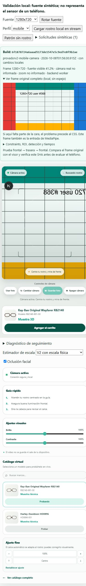
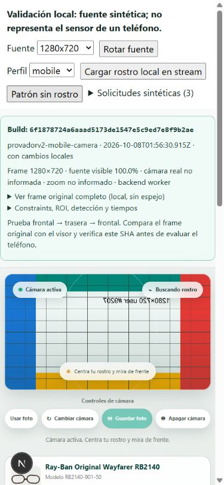

# Cámara móvil del probador V2

Fecha de pruebas: 7 de octubre de 2026, America/Santiago (registros UTC del 8 de octubre). La aceptación física en teléfono sigue pendiente del usuario.

## 1. Base aprobada y alcance

Rama nueva `provadorv2-mobile-camera`, creada directamente desde `6f1878724a6aaad5173de1547e5c9ed7e8f9b2ae`. No se incorporó código de `provadorv2-mobile-rebuild`. Los archivos de esa otra copia de trabajo permanecieron intactos; no se hizo merge a `main` ni se reescribió `provadorv2-scale-fix`.

Commit de implementación: `f9208d3b4746a72655c27539f79d96a69b5f549c` — **FIX Corregir adquisición y encuadre móvil del probador 3D**. La entrega añade un commit **TEST** con pruebas e informe. Su SHA final y la confirmación del push se indican en el mensaje de entrega, evitando una referencia circular dentro de este mismo archivo.

## 2. Causa demostrada del zoom de presentación

Los overrides de 780/490 px eliminaban el aspect ratio del visor y fijaban su altura mediante `clamp()`. Con `cover`, una fuente landscape tenía que crecer hasta llenar ese alto, perdiendo sus lados.

Medición en navegador con viewport solicitado de 390×844 y ancho útil real de 359,20 px:

- Fuente original: **1280×720**, completa, con marcadores en los cuatro bordes.
- Visor anterior: **359,20×490**; rectángulo del video: **871,11×490**.
- ROI visible: `x=376,10`, `y=0`, `width=527,80`, `height=720` en píxeles de fuente.
- Sólo **41,23%** del ancho original quedaba visible. Ampliación respecto de ocupar el ancho útil: **2,425×**.
- Después: visor **359,20×202,05**, video de igual tamaño, **100%** visible y ampliación **1×**. Las diferencias inferiores a 0,01 píxel proceden del redondeo CSS.

Los archivos `before-*` reproducen las reglas CSS aprobadas anteriores con el nuevo diagnóstico y fuentes sintéticas; **no** representan la negociación antigua de una cámara física. El frame original completo conserva todos los marcadores, mientras el visor anterior pierde sus lados. Esto distingue experimentalmente el recorte de presentación.

Evidencia: [antes](mobile-camera-evidence/before-1280x720.json), [después](mobile-camera-evidence/after-1280x720.json).

| Fuente | Visible antes | Visor después (px) | Visible después | Error video/Canvas estable |
| --- | ---: | ---: | ---: | ---: |
| 720×1280 | 76,73% | 359,20×638,58 | 100% | 0 px |
| 1080×1920 | 76,73% | 359,20×638,58 | 100% | 0 px |
| 1280×720 | 41,23% | 359,20×202,05 | 100% | 0 px |
| 640×480 | 54,98% | 359,20×269,40 | 100% | 0 px |





## 3. Adquisición móvil y fallbacks

Solicitud inicial móvil, con `resizeMode` solamente si el navegador informa soporte:

```json
{
  "audio": false,
  "video": {
    "facingMode": { "ideal": "user" },
    "frameRate": { "ideal": 30 },
    "resizeMode": { "ideal": "none" }
  }
}
```

No se solicitan `width`, `height` ni `aspectRatio` móviles. La clasificación móvil no cambia al rotar ni depende del ancho del visor. Se contempla iPadOS con UA Macintosh y puntero táctil.

Ante `OverconstrainedError`/`ConstraintNotSatisfiedError`, se intenta una solicitud mínima con facing ideal. Si los settings informan una cámara distinta de la solicitada, se detiene ese stream y se prueba facing **exact** una vez; si esa cámara no existe o resulta incompatible, se vuelve al ideal mínimo y se muestra el mismatch. Los intentos están acotados, no se reintentan errores de permiso y una solicitud obsoleta detiene su stream.

Si settings informan `crop-and-scale` y las capacidades permiten `none`, se intenta quitar ese recorte. Sólo se intenta reducir zoom si están disponibles soporte, método, zoom actual y rango numérico válido; se solicita el mínimo informado, nunca un incremento arbitrario. Se registran settings antes/después y errores: un constraint ignorado no se presenta como una corrección exitosa.

En las fuentes sintéticas, settings reales del track de `canvas.captureStream()` informaron las cuatro resoluciones, 30 fps y `resizeMode: none`. **Facing y zoom físicos no están disponibles**: el diagnóstico muestra `null`/“no informado”, sin inventar valores. Las pruebas de frontal → trasera → frontal comprueban solicitudes y renovación de sesiones; la elección de lentes/cámaras reales debe validarse en el teléfono.

Desktop conserva exactamente facing ideal, 1280×720, aspecto ideal 16/9 y frame rate ideal/max 60. No recibe ajustes nuevos de crop o zoom.

Referencia de comportamiento de constraints: [especificación Media Capture and Streams](https://w3c.github.io/mediacapture-main/#dom-mediatrackconstraintset-resizemode). `none` evita el recorte/reescala de esa negociación del navegador; no certifica el campo de visión óptico de un sensor o lente.

## 4. Qué falta demostrar sobre adquisición

La emulación responsive y los streams sintéticos no miden el sensor, el zoom óptico/digital, el comportamiento de la cámara frontal de iOS/Android ni la distancia natural del usuario. No se puede concluir que el zoom de adquisición del teléfono haya desaparecido.

En `?vtoDebug=1`, **Ver frame original completo** muestra el mismo stream de entrada de MediaPipe, con su proporción nativa y sin espejo ni recorte. Si la cara ya está incompleta allí, el problema precede al CSS. Comparar esta vista, settings, facing y zoom permite separar ese caso del recorte del visor. La ausencia de una propiedad de zoom no demuestra zoom cero.

## 5. Viewer, coordenadas y cambios de fuente

Se eliminaron las alturas fijas móviles y `aspect-ratio: auto`. El visor usa el aspecto realmente recibido, ancho útil completo, altura automática y scroll de página. Teléfonos landscape mayores de 780 px también usan este layout. Una fuente portrait queda alta; no se mete `contain` en un contenedor fijo.

Video y Canvas siguen en la **misma mediaLayer**, con el mismo `coverRectangle()` y proyección de fuente aprobados. No hay escalas independientes. Los cuatro JSON `after-*` registran error DOM estable **0 px** entre rectángulos video y Canvas.

Se actualizan dimensiones desde metadata/resize reales. Al cambiar la resolución, se limpia únicamente el estado previo del filtro, expresado en píxeles de la fuente anterior; el algoritmo y sus constantes no cambian. Una inferencia que atraviesa un cambio de resolución se descarta, para no interpretar landmarks de una fuente con dimensiones de otra. Se conserva el reloj, worker, scheduling y suavizado aprobados.

Rotación de fuente a 1920×1080 con viewport 844×390: fuente completa y alineación 0 px. Se verificaron cambios dinámicos entre las cuatro fuentes, cambio de cámara solicitado y apagar/encender el stream. El diagnóstico marca Canvas pendiente durante su remonte, sin confundirlo con un error geométrico estable.

Evidencia adicional: [rotación](mobile-camera-evidence/after-rotation.json), [cambio 1](mobile-camera-evidence/camera-switch-1.json), [cambio 2](mobile-camera-evidence/camera-switch-2.json), [reinicio](mobile-camera-evidence/after-restart.json).

## 6. Detección facial

MediaPipe mantiene entrada completa: `createImageBitmap(video)` en worker o `detectForVideo(video, timestamp)` en el thread principal. Se conservan todos los umbrales de confianza y archivos de tracking.

El diagnóstico distingue intentos, inferencias terminadas, con/sin rostro, errores de MediaPipe, rechazos/errores de conversión a pose y errores de inicialización. Incluye backend, FPS de cámara/inferencia/render, duración, latencia aproximada y descartes por resolución.

El patrón sin rostro produjo inferencias sin rostro y cero errores. Cargando localmente la imagen adjunta en un stream 1280×720 se registraron **363 inferencias con rostro**, **930 sin rostro** de la etapa con patrón, **0 errores MediaPipe**, **0 rechazos de pose** y **0 errores de inicialización**. La captura de métricas tuvo 22,10 inferencias/s de media y duración de la última inferencia de 21,10 ms, en esta máquina; no predice FPS de teléfono.

Sólo se conservaron [contadores y layout](mobile-camera-evidence/detection-local.json), sin imagen, landmarks o geometría facial de la persona. La imagen permaneció local, mediante un blob en memoria; no se copió al repositorio ni se envió a un servidor. Los JPEG del informe contienen exclusivamente el patrón sintético. También se retiraron identificadores de dispositivo de las evidencias públicas.

## 7. Fotografía guardada

Se probó **Guardar foto** con rostro/pose válidos tanto desde el stream como desde **Usar foto**. Descargas PNG verificadas localmente con Pillow:

- Stream: **1280×720**, a resolución completa, espejo de cámara y overlay en el mismo espacio.
- Foto original: **814×458**, resolución original y sin espejo adicional.

Las imágenes descargadas permanecen en el dispositivo y no están en Git. [Registro de dimensiones](mobile-camera-evidence/captures.json). Las pruebas de composición cubren también 720×1280, 1080×1920 y 640×480, cámara espejada y foto sin espejo; conservan la secuencia aprobada de dibujo.

## 8. Preservación notebook

[Fingerprints](../../tests/fixtures/notebook-approved-fingerprints.json) fijan SHA-256 de 17 archivos del commit aprobado: escala física/iris, geometría, PoseFilter, timeline, tracking worker/core, runtime/contrato/importador, proyección, renderer de modelos, ambos GLB y sus metadatos. Una prueba adicional fija el hash de todas las reglas CSS desktop anteriores al breakpoint móvil. Todos coinciden. No se agregó ningún `mobileScaleFactor`.

En el navegador, a 1366×900, el visor desktop mide **652,70×367,14** antes y después; el rectángulo cover y los constraints son idénticos, alineación 0 px. [Antes desktop](mobile-camera-evidence/desktop-before.json), [después desktop](mobile-camera-evidence/desktop-after.json). Los tests anteriores de escala física, anclaje, patillas, colisiones y filtros permanecen y pasan. Esta evidencia no sustituye otra prueba física del notebook.

## 9. Validación y reproducción

Comandos exigidos: `npm test`, `npm run lint`, `npm run build`. Resultado de entrega: **684 tests pasan**, lint sin errores y build de producción exitoso, 68 páginas generadas. El build final se realiza después del commit de validación, para verificar su identidad exacta con el árbol limpio.

La ruta `/virtual-try-on/3d/validation/camera?vtoDebug=1`, disponible **sólo en desarrollo**, ofrece fuentes sintéticas 720×1280, 1080×1920, 1280×720 y 640×480, rotación, cambios dinámicos y una imagen local opcional. Usa un MediaStream verdadero; en producción la ruta devuelve 404 y el provider inyectado se ignora.

Las evidencias del navegador se tomaron antes de los commits, sobre 6f18787 **con cambios locales**, como avisa su diagnóstico. No deben confundirse con un despliegue de 6f18787 sin esta corrección. El build de entrega congela el SHA completo de Vercel/Git en el bundle y lo muestra prominentemente junto con rama, fecha de compilación y estado local.

## 10. Entrega y prueba física pendiente

Destino de push: **únicamente `origin/provadorv2-mobile-camera`**. La URL exacta de Vercel, si su estado de despliegue permite obtenerla, y el SHA final se incluyen en el mensaje de entrega. No se deduce una URL mediante nombres o aliases que puedan apuntar a otro build.

Para la prueba física:

1. Abrir la URL de entrega con `/virtual-try-on/3d?vtoDebug=1` y confirmar que el SHA mostrado coincide con el entregado.
2. Activar frontal a distancia natural. Abrir el frame original y comparar cara completa en fuente y visor. Revisar dimensiones, facing real, crop y zoom informado.
3. Si el original está completo pero el visor no, revisar ROI. Si ambos están completos pero no aparece tracking, revisar con/sin rostro, errores y rechazos de pose; lentitud se evalúa con FPS/duración por separado.
4. Cambiar frontal → trasera → frontal, rotar y apagar/encender. Comprobar ambas monturas y guardar fotografía.
5. Confirmar notebook como antes y dar la aceptación móvil sólo después de probar el teléfono.

No se declara aceptación móvil física con estas pruebas.
