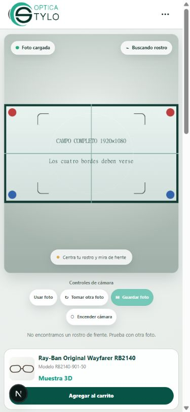

# Corrección de encuadre móvil — provadorv2

## Causa comprobada y lo que todavía debe medirse

La adquisición solicitaba en portrait móvil 720×960, aspect ratio 0,75 y
frame rate ideal/máximo 60. Desktop solicitaba 1280×720, ratio 16:9 y 60 FPS.
El viewer móvil tiene una altura de 380–510 px (hasta 490 px en teléfonos
estrechos), independiente del aspect ratio real. El media layer siempre usaba
`cover`: una fuente horizontal se ampliaba para cubrir esa altura y perdía
una gran parte de su ancho.

Ejemplo reproducible: fuente 1280×720, viewer 390×490 → layer 871,11×490.
Sólo se ve el 44,77% del ancho. En 390×700 se ve el 31,34%. Esto confirma el
recorte de presentación y explica la ampliación visual; no demuestra zoom de
hardware en el teléfono del usuario.

Los constraints `ideal` son preferencias. El navegador puede negociar otro
tamaño; puede además recortar/remuestrear el sensor. La orientación de los
settings puede diferir de la orientación primaria del sensor.
Referencia: [Media Capture and Streams, W3C](https://www.w3.org/TR/mediacapture-streams/).
La resolución real de ese teléfono aún debe medirse. 1280×720, 640×480 o
720×1280 son ejemplos posibles, no resultados medidos en Android/iOS aquí.

Importante: MediaPipe ya recibía el video original. Un crop de CSS no recorta
por sí mismo su entrada. Un crop previo aplicado por el navegador al negociar
el stream sí podría reducir lo que recibe, pero no se verificó en ese teléfono.

## Cambio acotado

- Desktop conserva exactamente sus constraints y su cálculo `cover`.
- Layout compacto: width ideal 1280, sin height ni aspectRatio solicitados.
  FPS permanece ideal/máximo 60; no se cambió la cadencia de tracking.
  `resizeMode: { ideal: "none" }` se añade sólo cuando
  `getSupportedConstraints()` lo declara. No es un requisito obligatorio.
- Pantallas de hasta 780 px y dispositivos táctiles sin hover usan `contain`.
  El segundo criterio mantiene el modo móvil cuando el teléfono rota y supera
  780 px. El layout CSS usa los mismos criterios, sin identificar navegadores.
- Video/foto y WebGL son hijos de un único rectángulo centrado con el ratio
  del medio original. Las guías móviles están dentro de ese rectángulo.
- ResizeObserver, media query en vivo y eventos `resize`/`loadedmetadata` del
  video recalculan tamaños. Cada stream crea constraints nuevos; callbacks de
  sesiones anteriores no pueden actualizar sus dimensiones.
- Pose, filtros, predicción, escala, puente, patillas, shaders, oclusión, GLB,
  importador y contrato permanecen sin cambios respecto a `7290abc`.

No se aplica `zoom: 1` ni se llama a `applyConstraints` para zoom. La webcam
local no expone zoom; falta evidencia de zoom real elevado en el teléfono.
Las APIs opcionales de settings/capabilities se consultan de forma tolerante a
ausencia/errores, también para Safari y navegadores que no las expongan.
Referencia de inspección de parámetros:
[Chrome, Camera settings](https://developer.chrome.com/blog/imagecapture/).

## Debug en teléfono físico

Abrir `/virtual-try-on/3d?vtoDebug=1`, activar cámara y desplegar
**Diagnóstico de seguimiento**. Se actualiza cada 500 ms, sólo en debug:

- constraints solicitados, `videoWidth`, `videoHeight`, ratio real;
- viewer y media layer CSS, modo `contain`/`cover`, fracción de fuente visible;
- `getSettings()` y `getCapabilities()`, incluyendo resolución, facingMode,
  frameRate, aspectRatio, resizeMode y zoom actual/min/max si se exponen.

Se omiten deviceId/groupId al copiar el diagnóstico. `null` significa que el
parámetro/API no está disponible, no que el zoom sea cero. La cámara frontal,
posterior y el regreso a frontal deben compararse con **actualFacingMode**;
`ideal: environment` no garantiza que un dispositivo con una sola cámara
entregue una posterior.

## Validación realizada

- 63 tests nuevos: 5 resoluciones fuente × 5 viewers × 2 modos, rotación,
  todos los bordes, conservación de aspect ratio, centrado, regresión desktop,
  constraints, cambio de cámara y ausencia de APIs/zoom.
- Total: **619 tests aprobados**, 0 fallos, 0 omitidos. Lint sin errores/warnings.
  Build correcto, 67 páginas; compilación observada de 3,8 segundos.
- Webcam de PC en IAB con viewport móvil: stream real 1280×720, settings 30 FPS,
  resizeMode `none`, zoom no expuesto. Viewer 359,2×490 y video/Canvas
  aproximadamente 359,19×202,04, idénticos entre sí; fuente visible 100%.
- Cambios user → environment → user recrearon los constraints. La webcam sólo
  dispone de frontal y lo indicó como facingMode real. No sustituye una prueba
  de dos cámaras físicas en un teléfono.
- Carta 1920×1080: los cuatro bordes visibles en portrait. Cambio de viewport
  390×844 → 760×390 → 390×844 recalculó el layer manteniendo alineación y
  `contain`. La tabla matemática incluye además viewer 844×390.

La captura conserva el pipeline de resolución original completa: video/foto y
Canvas se componen al mismo tamaño, sin guardar las bandas CSS. Las pruebas
de transformación comprueban que el píxel fuente no cambia al pasar por el
encuadre. Se descargaron y revisaron PNG de RB2140 en `contain` móvil y HD0896
en `cover` desktop sobre una foto de referencia: ambos conservaron sus
820×1024 originales, sin bandas, estiramiento ni desplazamiento del marco.
En desktop el rectángulo de foto y Canvas fue idéntico, aproximadamente
585,64×731,33 CSS px. Estas fotos temporales no se versionan.

La aceptación con cámara física Android/Samsung Internet/iOS sigue pendiente
del usuario. Responsive valida layout, no reproduce el sensor, sus lentes,
sus constraints efectivos ni posibles políticas particulares del navegador.
