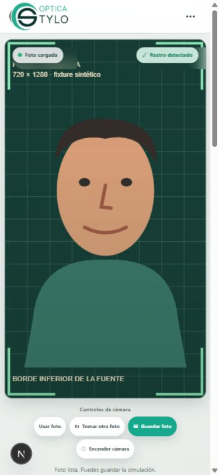

# Reconstrucción móvil desde el VTO aprobado

Rama: `provadorv2-mobile-rebuild`. Base exacta:
`7290abcfdd898b06a77416a5499e958370fb088c`.
Implementación: `dabb9696a9ed804bbea4e0edcd7dc5a092ad89a7`
(`FIX Reconstruir probador móvil desde baseline aprobado`).
Fecha de medición local: 2026-10-07, Windows / navegador integrado de Codex.
No se incorporaron por cherry-pick los parches rechazados ni sus descendientes.
**Pendiente de prueba humana en teléfono. Estas mediciones no confirman una corrección física móvil.**

Datos completos, sin redondeo: [evidencia JSON](./vto-mobile-rebuild-evidence.json).

## Visor y espacio de coordenadas

En el breakpoint compacto (≤780 px), la altura resulta del ancho disponible y
`videoWidth/videoHeight`. Se eliminaron las alturas `clamp` y los mínimos móviles.
La página permite scroll. `mediaLayer`, video/foto y WebGL ocupan el 100% de ese
visor: no hay cálculo `contain` separado. Desktop conserva su `coverRectangle`,
CSS, focal estimada, cámara y luces aprobados.

Medición DOM en viewport móvil solicitado de 390×844 (375 px útiles por scrollbar):

| Fuente | Aspect fuente | Visor CSS | Aspect visor | Media layer / imagen / canvas |
|---|---:|---|---:|---|
| Sintética 720×1280 | 0.562500 | 359.200×638.575 px | 0.562502 | mismos límites y aspect 0.562502 |
| Fotografía local 820×1024 | 0.800781 | 359.200×448.550 px | 0.800803 | mismos límites y aspect 0.800803 |

La diferencia de aspect es redondeo subpixel del navegador. En ambos casos los
cuatro rectángulos tienen los mismos x, y, ancho y alto. La imagen completa ocupa
todo el ancho útil; las esquinas y el borde inferior del fixture siguen visibles.
Se comprobó con foto y fuente sintética en la interfaz principal, que comparte
estas reglas de tamaño con el video. No se simuló una cámara portrait física.



[Fotografía con RB2140](./vto-mobile-rebuild-portrait-real.png).
Fixture reproducible: `tests/fixtures/portrait-720x1280.svg`.

La inferencia y la pose usan dimensiones de la fuente, nunca las del visor.
`cameraProjection` mantiene `fx=videoWidth`; es una estimación, no calibración
de las intrínsecas del teléfono.

## Escala y orientación

El RB2140 conserva su ancho físico **147.85990119 mm** y la referencia facial
aprobada **135 mm**. No hay factores de escala ni offsets por móvil, Android o
portrait; el ajuste manual ya existente conserva sus límites originales.

Cada pose válida contiene `diagnostics`, publicado en `vtoDebug=1` bajo `scale`:
dimensiones originales, cheeks/temples/ojos, Euler de matriz y de landmarks,
proyección, corrección, ancho corregido, px/mm, ancho del modelo, `pose.scale`,
ambos anchos normalizados y ratio marco/rostro. `rawFaceWidthPx` es el ancho XY
de mejillas después de desproyección, antes de compensar yaw;
`landmarkCheekWidthPx` es su distancia directa en píxeles de imagen.
`finalModelWidthPx=frameWidthMm×pose.scale` describe el ancho físico en el plano
de referencia, no un bounding box rasterizado del marco al girar la cabeza.

Se conserva la convención column-major y el espejo `S R S` del baseline. La base
independiente utiliza ojos, forehead, chin y productos cruzados, en fuente original.
La matriz continúa siendo preferida cuando es coherente. Sólo se sustituye si hay
al menos dos ejes laterales consistentes, proyección geométrica >0.3 y discrepancia
>35° o amplificación de proyección >1.5×. Ninguna decisión recibe un flag móvil.
El piso **0.35** se conserva.

Además, se comparan tres estimaciones de ancho: mejillas, temples y ojos. Las
proporciones de respaldo proceden del rostro canónico versionado: temples/cheeks
1.0102963369 y ojos/cheeks 0.5800826494. Si ojos y temples coinciden dentro del 20%
y mejillas difieren más del 30%, se utiliza su consenso. Una señal ocular corrupta
se identifica mediante el consenso de mejillas/temples. Las señales coherentes
conservan exactamente el cálculo aprobado, en lugar de recalibrar todos los rostros.
No interviene el iris. Los ratios son una referencia anatómica aproximada, no una
medición de la anatomía individual; no garantizan detectar corrupción simultánea
de varias señales o errores coherentes de toda la red.

Fixture frontal 720×1280 con **matriz errónea de yaw70 inyectada**:

| Magnitud | Baseline frente a matriz errónea | Rebuild |
|---|---:|---:|
| rawFaceWidthPx | 180.0000 | 180.0000 |
| projectionLength utilizado | 0.3500 | 1.0000 |
| correctionFactor | 2.857143 | 1.000000 |
| correctedFaceWidthPx | 514.2857 | 180.0000 |
| pixelsPerMm / pose.scale | 3.809524 | 1.333333 |
| finalModelWidthPx | 563.2758 | 197.1465 |
| frameToFaceRatio | 3.129310 | 1.095259 |

La matriz aporta projection 0.342020, yaw −70°, pitch/roll 0°. La base de landmarks
aporta projection 1, yaw 0°, pitch 0.703929°, roll 0°. La discrepancia es 70.003088°.
El fixture prueba que ese mecanismo puede inflar el marco y que el guard lo evita;
**no demuestra que el teléfono humano esté entregando esos valores**.

Con el SDK real y la fotografía local a entrada 513×640, reconstruida en 820×1024:

| Magnitud | Valor |
|---|---:|
| landmarkCheekWidthPx | 191.6191 |
| templeWidthPx | 193.2587 |
| eyeDistancePx | 116.9042 |
| rawFaceWidthPx | 218.3417 |
| projectionLength | 0.999430 |
| correctionFactor | 1.000570 |
| correctedFaceWidthPx | 218.4662 |
| pixelsPerMm / pose.scale | 1.618268 |
| finalModelWidthPx | 239.2770 |
| normalizedFrameWidth | 0.291801 |
| normalizedFaceWidth | 0.266270 |
| frameToFaceRatio | 1.095883 |

Orientaciones: matriz yaw/pitch/roll 1.9704°/4.6239°/0.3648°;
landmarks 2.1279°/1.5351°/1.3570°. Diferencia 3.2141°: se utiliza la matriz.

## Invariancia requerida

Mismo rostro canónico, misma geometría normalizada, tamaño proporcional al ancho
de fuente. En pose frontal:

| Fuente | rawFaceWidthPx | projection | correctedFaceWidthPx | px/mm | frameToFaceRatio |
|---|---:|---:|---:|---:|---:|
| 1280×720 | 320 | 1 | 320 | 2.370370 | 1.095258527333 |
| 640×360 | 160 | 1 | 160 | 1.185185 | 1.095258527333 |
| 1920×1080 | 480 | 1 | 480 | 3.555556 | 1.095258527333 |
| 720×1280 | 180 | 1 | 180 | 1.333333 | 1.095258527333 |
| 480×853 | 120 | 1 | 120 | 0.888889 | 1.095258527333 |
| 360×640 | 90 | 1 | 90 | 0.666667 | 1.095258527333 |

Diferencia absoluta máxima: **2.22×10⁻¹⁶**. Tests adicionales cubren yaw −45/0/+45,
pitch, roll, espejo, orientación absurda y corrupción individual de señales.

La prueba del facade real de tracking, con SDK controlado y worker/main thread,
procesa superficies 360×640, 270×480 y 203×360. Reconstruye siempre en 720×1280:
pose completa, máscara, fitting, escala y posición son idénticos. También comprueba
dimensiones antes del detach de ImageBitmap, cierre y rechazo de inferencia concurrente.
Si un bitmap nativo presenta dimensiones diferentes a `videoWidth/videoHeight`,
se vuelve a copiar a la superficie del tamaño declarado; este caso también se prueba.
Con el SDK real, el ratio entre entradas native/640/480/360 varía menos del 0.01%
en esta imagen; la red no es matemáticamente invariante a resolución.

## Pipeline, gráficos y tiempos

El video visible se mantiene independiente de una superficie reutilizable de
inferencias. Se redimensiona el frame completo, sin crop/espejo ni cola. Worker
empieza con dimensión mayor 640; main thread, con 480. Adaptación hasta 360 según
p95 de SDK/entrega y render FPS. Ventana de 64 muestras, decisiones cada 16 tras
32 iniciales, dos ventanas malas para bajar, mínimo 3 s entre cambios; seis buenas
y mínimo 10 s para recuperar. Las muestras de la resolución previa se descartan.
Desktop registra métricas pero mantiene resolución nativa y cadencia aprobada.

Captura compacta: preferencia de ancho 960 y 30 FPS; no se solicita `resizeMode`.
Desktop: preferencias originales 1280×720, aspect16:9, 60 FPS. El navegador puede
negociar otra entrega real. Perfil compacto: DPR1 y environment64, materiales,
luces y antialias conservados. Se mantiene el proxy 24×16 para conservar su
oclusor; no se reduce por aproximación la superficie que oculta las patillas.
Sólo se sube la máscara a GPU con nueva pose o nueva geometría. Las transformaciones
de RAF reutilizan objetos; la telemetría agregada se actualiza cada 500 ms.

PoseFilter es **idéntico al baseline**: edad máxima 180 ms desde la captura,
predicción máxima 25 ms con apagado progresivo. Uno/dos misses cercanos no renuevan
la edad de la pose. Una inferencia que llega tarde no compra más grace. Al exceder
el presupuesto se publica `performanceBudget=exceeded`; no se alarga el filtro para
disimularlo. Un equipo permanentemente lento puede seguir perdiendo la pose: requiere
medición física y no puede solucionarse prometiendo continuidad mediante este test.

Benchmark real: fotografía local 820×1024 a 30 Hz, RB2140 + WebGL activo, 8
muestras de calentamiento y 48 medidas por caso, por backend. Inferencia es el
tiempo dentro del SDK; entrega es el intervalo entre resultados completos;
latencia de procesamiento incluye preparación, transferencia, pose y fitting.
No incluye movimiento humano o latencia desde el sensor de una cámara.

| Backend | Input MP | SDK p50/p95 ms | Entrega p50/p95 ms | Render FPS |
|---|---|---|---|---:|
| worker | 820×1024 | 27.30 / 31.40 | 67.10 / 99.50 | 60.00 |
| worker | 513×640 | 24.30 / 30.00 | 33.40 / 41.30 | 60.01 |
| worker | 384×480 | 23.30 / 28.60 | 33.70 / 40.30 | 60.09 |
| worker | 288×360 | 22.50 / 26.70 | 33.60 / 38.60 | 60.00 |
| main thread | 820×1024 | 36.80 / 42.10 | 66.70 / 100.80 | 45.05 |
| main thread | 513×640 | 21.90 / 24.30 | 33.30 / 37.00 | 57.57 |
| main thread | 384×480 | 21.40 / 24.80 | 33.60 / 36.20 | 59.99 |
| main thread | 288×360 | 25.40 / 27.40 | 33.30 / 36.10 | 59.14 |

48/48 poses válidas en cada caso. 360 no fue la entrada más rápida en main thread;
los tamaños menores no garantizan mejoras lineales. Worker640 elimina buena parte
del coste de copiar un video nativo y logra entrega cercana a 30 Hz en este equipo.

Smoke test con webcam real de Windows, sin rostro presente:

| Perfil | Cámara entregada | Input MP | Backend | SDK p50/p95 ms | Entrega p50/p95 ms | Render FPS |
|---|---|---|---|---|---|---:|
| Compacto | 960×540, settings30 FPS | 480×270 | worker | 12.20 / 17.70 | 66.50 / 83.90 | 60.30 |
| Desktop | 1280×720, settings30 FPS | 1280×720 | worker | 10.90 / 33.00 | 69.10 / 158.20 | 61.46 |

Compacto registró una transición de 640 a 480. La webcam entregaba aproximadamente
15 frames/s pese a settings30. Desktop conservó native, environment128 y DPR1–1.5;
su sesión coincidió con carga de CPU de los checks locales. Estas sesiones sólo
verifican captura, dimensiones y coordinación; no validan fitting o seguimiento
humano ni proporcionan un benchmark de regresión desktop.

## Protección del desktop y reproducción

Goldens generados leyendo directamente el objeto git de `7290abc`, sin ejecutar
un checkout modificado. Se compara cada campo aprobado de 30 poses por modelo,
incluyendo 1404 coordenadas de máscara, proxy, targets y fitting de ambas patillas:

- RB2140 SHA256: `2f93d7b4c1b566d1b3d0cae030aed8a00cb75f6ccf5211096629ad9746d7cc06`.
- HD0896 SHA256: `1a70c61aa2d76b6edf5265006002a31314a39f4058d0a8a074eff8409dce4060`.
- Fuente PoseFilter SHA256: `d545f3d2f3a928b26540120d30c8a92a4cf8c13ad6345e78c8059f628ca9c555`.

Los tres coinciden. Los assets, metadata física y materiales del modelo no se
modificaron. Los tests no regeneran sus goldens. Estos fingerprints y los tests
son evidencia del comportamiento matemático probado, no sustituyen la prueba
humana de notebook que aprobó el baseline.

```sh
npm test
npm run lint
npm run build
```

584 pruebas; lint y build sin errores en la revisión final. El primer build encontró
una carpeta generada de `.next/server` con atributos OneDrive y no pudo limpiarla;
se movió esa caché a `tmp/vto-mobile-rebuild/production-cache-before-build` y la
compilación volvió a generar su salida. No se modificó configuración ni dependencias.

`/virtual-try-on/3d/validation/performance` sólo existe en desarrollo. Permite elegir
una imagen local, ejecutar worker o main thread y exportar el JSON visible. Se
verifican HTTP200 del probador y HTTP404 de este harness en producción.

`scripts/capture-vto-desktop-baseline.mjs` reproduce la captura del golden desde
el SHA exacto; sólo debe ejecutarse explícitamente. `scripts/report-vto-mobile-rebuild.mjs`
consolida los JSON observados en `tmp/vto-mobile-rebuild` y la invariancia sintética.
Para pruebas humanas, abrir el probador con `?vtoDebug=1`; comparar `scale`, `layout`,
`source`, `trackingInput`, p50/p95, FPS y presupuesto después del calentamiento.

Convenciones contrastadas con fuentes primarias: [landmarks normalizados y profundidad](https://github.com/google-ai-edge/mediapipe/blob/master/docs/solutions/face_mesh.md),
[MatrixData column-major](https://github.com/google-ai-edge/mediapipe/blob/master/mediapipe/framework/formats/matrix_data.proto)
y [resultado FaceLandmarker](https://ai.google.dev/edge/api/mediapipe/python/mp/tasks/vision/FaceLandmarkerResult).

No se ha mezclado esta rama con `main` ni `provadorv2`. La evaluación siguiente
corresponde a la prueba física del usuario en esta rama nueva.
