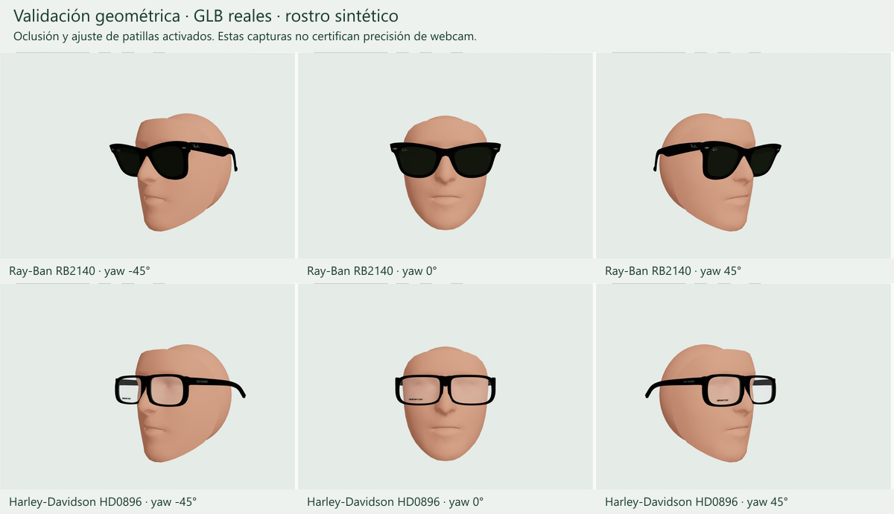

# Intervención VTO V2 — Óptica Stylo

Entrega del 7 de octubre de 2026, rama `feature/vto-perfection-v2`.
El cambio es una base considerablemente más sólida y verificable. No se certifica
todavía precisión anatómica universal ni rendimiento en teléfonos reales.

## A. Diagnóstico inicial

La [auditoría previa](vto-v2-audit.md) se comprometió antes de implementar.
Los problemas principales eran arquitectónicos:

- Inferencia síncrona dentro de RAF, con un techo fijo de 25 Hz y sin comprobar
  si el video había entregado otro frame. El filtro agregaba retraso a mediciones
  ya antiguas, con coeficientes basados en error contra la pose filtrada.
- El puente almacenado no participaba en el apoyo. Se usaba el centro ocular,
  un offset de modelo de 2 mm, otro de usuario de 2 mm y escala inicial 0,97.
- La escala dependía en un 45% del diámetro de iris medido por frame. La
  orientación elegía signos de Euler mediante una heurística de nariz.
- Ambas patillas recibían un ángulo idéntico; no había colisión. El shader usaba
  coordenadas locales frente a anchors calculados en mundo GLB.
- La máscara se filtraba por separado: podía desfasarse respecto al marco.
- El importador exigía nombres, suponía ejes y adivinaba unidades por magnitud.
  RB2140 tenía un script con hash fijo, origen y puente manuales.
- La validación visual descubrió otro defecto: video/foto y canvas usaban
  diferentes rectángulos `cover` para fuentes verticales.
- Se corrigieron invalidación de sesiones/fotos/modelos, resultados tardíos,
  readiness al repetir una foto y comprobación SHA antes de publicar.

Tracking, fitting, deformación e importación requirieron rediseño. Catálogo,
carrito, checkout, APIs comerciales y datos de producción no se modificaron.

## B. Referencias open source

| Referencia | Técnicas observadas | Decisión |
|---|---|---|
| [WebAR.rocks.face](https://github.com/WebAR-rocks/WebAR.rocks.face) | PnP con focal y correspondencias, estabilizadores incluyendo One Euro, bending/fading por shader, oclusores de profundidad | Adoptar conceptos de intrínsecos, adaptación a velocidad y deformación. Descartar ángulo global y dependencia de nombres de material. MIT verificada |
| [GlassesTryOn](https://github.com/estephanobrusa/GlassesTryOn) | Runner/estimator/applier/scene separados; eye line, forehead/chin, base ortogonal y quaternion; smoothing adaptativo | Adoptar separación y fallback ortogonal. Descartar offsets/escala genéricos y coeficientes por frame. CameraCalibration declaraba intrínsecos que su estimator no usaba. MIT verificada |
| [basic-virtual-tryon-glasses](https://github.com/alperenuzun/basic-virtual-tryon-glasses) | FaceLandmarker, control de inferencia, ejes ortogonales, fan de Face Oval con centro profundo | Sólo conceptos: no se encontró LICENSE. Conservar máscara densa de Stylo para representar nariz y profundidad |

Se inspeccionaron los commits y clases concretas indicados en la auditoría.
No se copió implementación de estos proyectos. Se consultaron además
[MediaPipe Web](https://developers.google.com/edge/mediapipe/solutions/vision/face_landmarker/web_js)
y [One Euro](https://gery.casiez.net/1euro/). El fixture facial canónico tiene
[atribución y licencia Apache 2.0 conservadas](third-party-notices.md).

## C. Arquitectura nueva

```text
Cámara → RVFC (fallback RAF + currentTime) → gate de una inferencia
       → ImageBitmap → FaceLandmarker en worker (fallback en main thread)
       → landmarks + matriz facial → pose y escala física
       → apoyo nasal → targets laterales + proxy → solver de cada patilla
       → filtro temporal por canal → predicción breve → RAF / Three.js
```

No hay cola de imágenes. Un resultado sólo se acepta en su sesión y modelo;
timestamps antiguos se descartan. React guarda estados de UI/transiciones;
la pose, filtros, shaders y métricas circulan por refs.

```text
GLB → geometría en mundo fuente → candidatos de ejes (PCA + bases)
    → evaluación de frente/altura/patillas → sistema canónico
    → dimensión autoritativa → milímetros → corte central del puente
    → anchors + clasificación geométrica + capacidades + envolventes
    → sidecar V2 → geometría horneada una vez → runtime
```

Convención: **X derecha, Y arriba, Z hacia el espectador; patillas hacia -Z**.
Permite aplicar el quaternion de cabeza directamente. La matriz column-major
transforma `p` mediante `C(p)=s·(R·p−b)`, donde `b` es el apoyo nasal en el
espacio rotado y `s=frameWidthMm/anchoFuente`. V1 sigue validándose y tiene
adaptador: su yaw se hornea una vez, fuera de la orientación de cabeza.

La matriz facial MediaPipe se interpreta como Eigen column-major, se elimina
escala y se aplica `R_espejo=S·R·S`, con `S=diag(-1,1,1)`. La traslación procede
de la nariz; la escala de laterales rígidos, compensados por profundidad y
proyección de la orientación. Iris y movimiento ocular quedan excluidos.

La cámara es perspectiva: focal estimada `fx=fy=videoWidth`, reemplazable por
focal calibrada. A profundidad del puente, una unidad de escena es un píxel de
video. Se desproyectan landmarks y se usa un mismo rectángulo `cover` para
video, foto y WebGL, incluso en recortes verticales.

## D. Archivos modificados

La lista completa al final de este documento incluye código, tests, sidecars,
evidencias y los archivos de instrucciones que Next.js generó al ejecutar dev.
Los dos binarios GLB originales se conservaron.

## E. Tracking y estabilidad

- RVFC sigue frames reales; RAF sólo es el fallback de adquisición y el reloj
  visual. Se eliminó `TRACKING_INTERVAL_MS=40`.
- Cadencia adaptativa según duración observada: intervalo mínimo de 1,15 veces
  el coste de procesamiento, sin backlog. GPU se intenta primero, luego CPU.
- Position/scale/temples usan filtros tipo One Euro dependientes de tiempo y
  velocidad. Rotación usa distancia angular y slerp de quaternion normalizado.
- Cutoffs mínimos: posición 2,5 Hz; escala 1,5 Hz; rotación 3 Hz; patillas 4 Hz.
  La respuesta aumenta al moverse. No hay dead zone que acumule desplazamiento.
- Predicción lineal y angular de **hasta 25 ms**, limitada a 12 px / 0,1 rad.
  Ruido pequeño no genera extrapolación; una medición de parada cancela velocidad.
  La predicción pierde confianza si no llegan frames. Se oculta tras 180 ms sin
  pose y se reinicia al recuperar, sin arrastrar velocidad anterior.
- El renderer reutiliza vectores, buffers y uniformes; no crea filtros ni
  suaviza otros 1.404 valores de máscara en cada RAF. Queda una máscara nueva
  por medición, aproximadamente 5,6 KiB: optimización deliberadamente limitada.

## F. Patillas y oclusión

Cada lado tiene hinge, dirección, muestras de superficie interior y hasta
48 envolventes de profundidad. El solver calcula apertura suficiente para un
elipsoide estimado de cabeza más **1 mm de margen**. Dentro de cada tramo usa
una cota conservadora: sección máxima del elipsoide y palanca mínima. Esto
cubre los vértices entre las muestras, además de los puntos muestreados.

La deformación es `dx=lado·tan(θ)·d²/(d+12 mm)`, con `d=max(0,hingeZ−z)`.
No desplaza la bisagra; su derivada inicial es cero. CPU y shader comparten
esta ley; las normales se corrigen por la transformación inversa transpuesta.
Máximo: 0,35 rad, aproximadamente 20°. Un caso imposible queda marcado
`constrained`; no se finge que cualquier marco puede abrir indefinidamente.
Al suavizar se respeta la apertura mínima de clearance: la reducción es suave,
el aumento necesario para evitar colisión se aplica inmediatamente.

Cabezas simétricas pueden necesitar aperturas iguales aun durante yaw: la
perspectiva cambia la imagen, no el ancho anatómico. El cálculo sigue siendo
independiente; las pruebas con cabezas asimétricas dan aperturas diferentes.

Máscara de 468 puntos y elipsoide posterior escriben profundidad con
`colorWrite=false`, `depthWrite=true`, antes de las gafas. Ambos comparten
posición/quaternion/escala con el marco. El proxy posterior cubre cráneo que
FaceMesh no observa. La colisión geométrica se resuelve antes de ocluir.

## G. Cómo incorporar ahora un modelo

Un **GLB rígido, autocontenido y de gafas abiertas**, más `dimensionsMm.frameWidth`
en un JSON de identidad/rutas, basta en los casos geométricamente reconocibles.
También puede declararse `units: "m"` o `"mm"` cuando se conocen inequívocamente.
Las dimensiones de cristal, puente y patilla son opcionales; no se rellenan
con medidas absolutas inventadas. Recursos externos se rechazan; data URI y
texturas embebidas se preservan. El análisis no necesita decodificar texturas.

```bash
npm run frames:import-3d -- config/virtual-try-on-3d/nuevo-marco.json
```

El sidecar contiene transformación, escala, anchors/confianza, piezas opcionales,
capacidades, información de oclusión y geometría de patillas. Los nombres aportan
señales; geometría, ubicación y material permiten nombres arbitrarios.

**Full** admite bending y materiales de lentes; **Partial** conserva lo que
puede detectarse; **Basic** permite una malla fusionada normalizada y ajustada
sin bending avanzado. No se rechaza simplemente por carecer de nombres.
La publicación existente verifica SHA sidecar/GLB antes de acceder a la BD.
No se ejecutó publicación ni ninguna escritura de datos productivos.

## H. Controles manuales

Tamaño ± y altura ± permanecen sólo con `?vtoDebug=1`, junto a un interruptor
de oclusión y métricas. Valores normales: **escala 1, offset 0**. También funciona
el reajuste de una foto en debug. Brillo, contraste, cámara, cambio de cámara,
foto y captura siguen siendo controles normales. Se añadió acceso explícito
a foto como alternativa a la webcam.

Debug: `window.__OPTICA_STYLO_VTO__.snapshot()` o el panel visible. Incluye FPS
de cámara, render e inferencia, coste SDK/procesamiento, edad, latencia aproximada,
velocidad facial, alphas aplicados y límites de patillas.

## I. Tests y validación

**556 tests pasaron; 0 fallos, 0 omitidos.** `npm test`, `npm run lint` y
`npm run build` completaron correctamente. Lint: 0 errores/0 warnings.
Build: 67 páginas generadas; compilación final observada de 5,9 segundos.

La suite prueba rotaciones ±90° X, 180° Y/Z, orientación arbitraria, metros/mm,
origen lejano, nombres arbitrarios, malla fusionada y reproducción de ambos
sidecars reales. También timestamps viejos/duplicados, inferencia lenta,
15/30/60 FPS, movimientos de 30 y 700 px/s, parada, jitter, pérdida/recuperación,
yaw/pitch/roll, iris, zoom, espejo, reproyección, cover, asimetría y límites.
Se comprobaron **todos los vértices** de las patillas reales para cabezas de
115/135/150 mm, además de muestras y casos imposibles.

Se levantó Next y se inspeccionó fotografía de referencia, cámara, cambio de
modelo y flujo normal sin ajustes. El replay de desarrollo permitió verificar
frente, yaw ±15/30/45°, pitch ±25°, zoom 0,7/1,3 y movimiento a 30 Hz de medición.
Se inspeccionaron layouts con overrides 1280×900 y 390×844 en IAB. Esto no
equivale a ejecutar el sistema en un teléfono físico.

Replay: `/virtual-try-on/3d/validation`, **sólo disponible en desarrollo**.
Está bloqueado con `notFound()` en producción. Se comprobó mediante HTTP:
probador normal 200 y replay 404 con `next start` tras el build final.



## J. Performance observada

[Benchmark reproducible](vto-v2-benchmark.json), Node 24.19.0 / Windows x64,
1.000 frames sintéticos con calentamiento; ejecutar `node scripts/benchmark-vto.mjs`:

| Modelo | Pose + fitting + filtro p50 | p95 | Importación | Jitter sintético RMS |
|---|---:|---:|---:|---:|
| Harley HD0896 | 0,0484 ms | 0,1263 ms | 217,52 ms | 0,0718 px |
| RB2140 | 0,0861 ms | 0,2139 ms | 348,76 ms | 0,0718 px |

Estas cifras no incluyen SDK, captura, transporte, shaders o GPU.
[Replay](vto-v2-replay-evidence.json): aproximadamente 58–60 FPS; datos de
[pitch/zoom/movimiento](vto-v2-replay-extended.json) también guardados.

[Snapshot de webcam](vto-v2-camera-metrics.json): backend worker, cámara media
21,92 FPS, inferencia media 21,01 FPS, render 59,98 FPS; SDK 11,3 ms,
procesamiento suavizado 13,76 ms y latencia aproximada 31,3 ms. La sesión final
no tenía un rostro detectado; FPS incluyen arranque. **No demuestra jitter ni
latencia de movimiento humano.** No se guardaron imágenes personales.

Quedan warnings de dependencias en navegador: deprecación de THREE.Clock
y avisos numéricos de ANGLE en shaders de iluminación. No hubo errores WebGL
en las vistas verificadas. Las 9 vulnerabilidades high informadas por npm al
instalar ya pertenecían al lockfile; no se actualizaron dependencias ajenas.

## K. Modelos actuales

- **Harley-Davidson HD0896:** sidecar V2 genérico reproducible, 137 mm,
  Full, bisagras y patillas detectadas, marcas asociadas por ubicación,
  clearance de todos sus vértices y render verificados. Sin offset/yaw de fitting.
- **RB2140:** mismo pipeline, 147,85990119 mm heredados de la reconstrucción,
  Full, puente derivado del frente fusionado e inscripciones asociadas a patillas.
  Conserva GLB/hash, dimensiones 50/22/150 y apariencia G-15 existente.
  Ya no necesita `prepare-rb2140-model.mjs`.

No se requirieron ajustes manuales de fitting en los casos verificados. Esto
no certifica regresión cero en todas las personas/dispositivos no probados.

## L. Limitaciones y aceptación restante

1. La focal sigue estimada y el ancho físico facial usa un prior de 135 mm.
   Una webcam monocular no aporta por sí sola medidas craneales absolutas.
   Un rostro muy distinto puede requerir calibración **por persona**, no por marco.
2. El importador es inferencia heurística, no reconocimiento semántico universal.
   Gafas cerradas, orientación intrínsecamente ambigua, geometrías atípicas o
   ausencia de apoyo nasal fiable requieren revisión. Confidence no es una
   probabilidad estadística calibrada. No hay decodificadores Draco/Meshopt ni
   soporte de skin/morph en este pipeline; no se certificaron otros activos reales.
3. Basic/Partial no deforman una patilla fusionada no separable. El proxy estima
   cabeza posterior; no mide orejas, pelo ni cráneo real. La deformación es una
   aproximación de bending, no una articulación mecánica exacta de longitud fija.
4. Un marco físicamente demasiado angosto puede alcanzar el límite de apertura.
   Se reporta en debug y los tests lo contemplan; no se garantiza clearance allí.
5. No se completó una sesión humana controlada de movimientos rápidos ni una
   matriz de Android/iOS físicos. El fallback síncrono aún puede bloquear el
   main thread en dispositivos sin worker/OffscreenCanvas utilizables.

Aceptación determinista cumplida: una inferencia, descarte de resultados viejos,
quaternions normalizados, iris independiente, diferencia física entre marcos,
invariancias de GLB, bounds de predicción y clearance en casos normales probados.
El objetivo de render ≥55 Hz en pantalla 60 Hz se observó en este PC. Quedan
pendientes p95 de edad/latencia **con rostro en movimiento**, jitter real <0,5 px
y validación humana/móvil de ausencia de penetración visible. No se declaran
cumplidas métricas que los fixtures no pueden demostrar.

## M. Git y revisión

Rama: `feature/vto-perfection-v2`, sin merge ni push a main.
Commits de implementación: `d8fdea6` auditoría, `d1a8625` GLB V2,
`9ae77b9` tracking/fitting/render. El commit de validación incorpora este informe,
replay, evidencias y archivos AGENTS/CLAUDE autogenerados por Next dev.
El SHA definitivo de HEAD y el estado del árbol se entregan en el mensaje final,
después de comprometer el informe, evitando un hash autorreferencial.

El servidor de desarrollo queda en `http://localhost:3000`. La cámara se dejó
apagada. Puede revisarse el flujo normal, activar debug o abrir el replay.

## Lista completa de archivos

48 archivos afectados respecto a main. Los GLB binarios y el lockfile no cambiaron.

| Estado | Archivo |
|---|---|
| Añadido | [AGENTS.md](../../AGENTS.md) |
| Añadido | [CLAUDE.md](../../CLAUDE.md) |
| Modificado | [config/virtual-try-on-3d/HD0896-001.json](../../config/virtual-try-on-3d/HD0896-001.json) |
| Añadido | [config/virtual-try-on-3d/RB2140-901-50.json](../../config/virtual-try-on-3d/RB2140-901-50.json) |
| Añadido | [docs/3d/licenses/mediapipe-apache-2.0.txt](licenses/mediapipe-apache-2.0.txt) |
| Modificado | [docs/3d/rb2140-v2.19.md](rb2140-v2.19.md) |
| Añadido | [docs/3d/third-party-notices.md](third-party-notices.md) |
| Añadido | [docs/3d/vto-v2-audit.md](vto-v2-audit.md) |
| Añadido | [docs/3d/vto-v2-benchmark.json](vto-v2-benchmark.json) |
| Añadido | [docs/3d/vto-v2-camera-metrics.json](vto-v2-camera-metrics.json) |
| Añadido | [docs/3d/vto-v2-replay-evidence.json](vto-v2-replay-evidence.json) |
| Añadido | [docs/3d/vto-v2-replay-extended.json](vto-v2-replay-extended.json) |
| Añadido | [docs/3d/vto-v2-report.md](vto-v2-report.md) |
| Añadido | [docs/3d/vto-v2-visual-validation.png](vto-v2-visual-validation.png) |
| Modificado | [public/virtual-try-on/models/Harley-Davidson_HD0896_001_V4_definitivo.tryon.json](../../public/virtual-try-on/models/Harley-Davidson_HD0896_001_V4_definitivo.tryon.json) |
| Modificado | [public/virtual-try-on/models/RB2140-901-50-v2.19.tryon.json](../../public/virtual-try-on/models/RB2140-901-50-v2.19.tryon.json) |
| Añadido | [scripts/benchmark-vto.mjs](../../scripts/benchmark-vto.mjs) |
| Modificado | [scripts/import-3d-frames.mjs](../../scripts/import-3d-frames.mjs) |
| Retirado | `scripts/prepare-rb2140-model.mjs` |
| Modificado | [scripts/publish-3d-model.mjs](../../scripts/publish-3d-model.mjs) |
| Añadido | [src/app/virtual-try-on/3d/face-tracking-core.js](../../src/app/virtual-try-on/3d/face-tracking-core.js) |
| Modificado | [src/app/virtual-try-on/3d/face-tracking.js](../../src/app/virtual-try-on/3d/face-tracking.js) |
| Añadido | [src/app/virtual-try-on/3d/face-tracking.worker.js](../../src/app/virtual-try-on/3d/face-tracking.worker.js) |
| Modificado | [src/app/virtual-try-on/3d/glasses-3d-interface.js](../../src/app/virtual-try-on/3d/glasses-3d-interface.js) |
| Modificado | [src/app/virtual-try-on/3d/glasses-3d-overlay.js](../../src/app/virtual-try-on/3d/glasses-3d-overlay.js) |
| Modificado | [src/app/virtual-try-on/3d/glasses-model.js](../../src/app/virtual-try-on/3d/glasses-model.js) |
| Añadido | [src/app/virtual-try-on/3d/validation/page.js](../../src/app/virtual-try-on/3d/validation/page.js) |
| Añadido | [src/app/virtual-try-on/3d/validation/validation-viewer.js](../../src/app/virtual-try-on/3d/validation/validation-viewer.js) |
| Modificado | [src/app/virtual-try-on/3d/virtual-try-on-3d.module.css](../../src/app/virtual-try-on/3d/virtual-try-on-3d.module.css) |
| Modificado | [src/utils/virtual-try-on-3d-geometry.js](../../src/utils/virtual-try-on-3d-geometry.js) |
| Añadido | [src/virtual-try-on-3d/camera-projection.js](../../src/virtual-try-on-3d/camera-projection.js) |
| Modificado | [src/virtual-try-on-3d/model-contract.js](../../src/virtual-try-on-3d/model-contract.js) |
| Modificado | [src/virtual-try-on-3d/model-importer.js](../../src/virtual-try-on-3d/model-importer.js) |
| Modificado | [src/virtual-try-on-3d/model-materials.js](../../src/virtual-try-on-3d/model-materials.js) |
| Añadido | [src/virtual-try-on-3d/model-runtime.js](../../src/virtual-try-on-3d/model-runtime.js) |
| Añadido | [src/virtual-try-on-3d/pose-filter.js](../../src/virtual-try-on-3d/pose-filter.js) |
| Añadido | [src/virtual-try-on-3d/temple-fitting.js](../../src/virtual-try-on-3d/temple-fitting.js) |
| Añadido | [src/virtual-try-on-3d/tracking-timeline.js](../../src/virtual-try-on-3d/tracking-timeline.js) |
| Añadido | [tests/fixtures/canonical-face.json](../../tests/fixtures/canonical-face.json) |
| Añadido | [tests/fixtures/hd0896-v1.json](../../tests/fixtures/hd0896-v1.json) |
| Añadido | [tests/fixtures/vto-fixtures.js](../../tests/fixtures/vto-fixtures.js) |
| Modificado | [tests/utils/virtual-try-on-3d-geometry.test.js](../../tests/utils/virtual-try-on-3d-geometry.test.js) |
| Añadido | [tests/virtual-try-on-3d/importer-invariance.test.js](../../tests/virtual-try-on-3d/importer-invariance.test.js) |
| Modificado | [tests/virtual-try-on-3d/model-contract.test.js](../../tests/virtual-try-on-3d/model-contract.test.js) |
| Modificado | [tests/virtual-try-on-3d/model-importer.test.js](../../tests/virtual-try-on-3d/model-importer.test.js) |
| Modificado | [tests/virtual-try-on-3d/rb2140-model.test.js](../../tests/virtual-try-on-3d/rb2140-model.test.js) |
| Añadido | [tests/virtual-try-on-3d/temple-fitting.test.js](../../tests/virtual-try-on-3d/temple-fitting.test.js) |
| Añadido | [tests/virtual-try-on-3d/tracking.test.js](../../tests/virtual-try-on-3d/tracking.test.js) |
